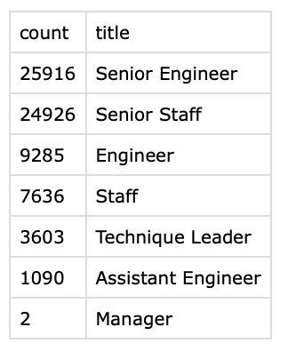

# Pewlett-Hackard-Analysis
Analysis using SQL,
## Overview of the analysis:
### Purpose
The purpose of this analysis is to identify the number of employees by title, who are eligible for a mentorship program, as well as a report for the current employees who have reached retirement age.
## Results:
From the two different queries that were created, there are four major points:
- There are a total of 50,842 total senior staff that have hit the age of retirement, and a total of 72,458 employees that will retire, as seen in the chart below. 
- There are roughly 1,550 eligible employees for the mentorship program.
- Roughly 70% of employees who have hit the retirement age are senior staff, 13% are engineers.
- The total number of employees who have hit the age of retirement make up nearly a quarter of tottal employees at Pewleet Hackard.
## Summary:
After analysing the results, there are two questions that must be answered; How many roles will need to be filled as the "silver tsunami" begins to make an impact? And are there enough qualifed, retirement-ready employees in the departments to mentor the next generation of Pewlett Hackard employees? 

Regarding the amount of roles that would need to be filled, the "silver tsunami" will cause nearly a quarter of jobs to be lost to retirees, for a total of 50,842 jobs that will need to be filled, as can be seen in the retiring_titles.csv file.

When it comes to the next generation of Pewlett Hackard employees ready to take on the guantlet, there are only 1,550 total employees who are eligible for the mentorship program, a number that falls way below the amount needed to fill the vacancies that will be left as a result of those retiring. The total amount of eligible employees for the mentorship program can be seen in the mentorship_eligibility.csv file.
